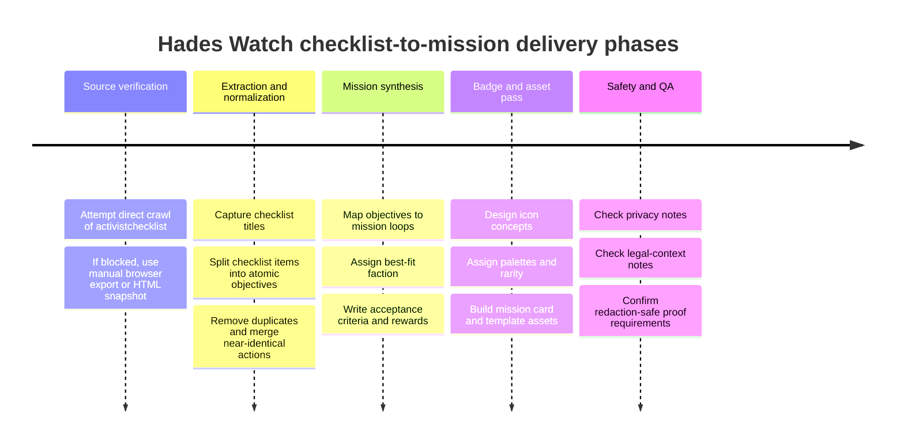
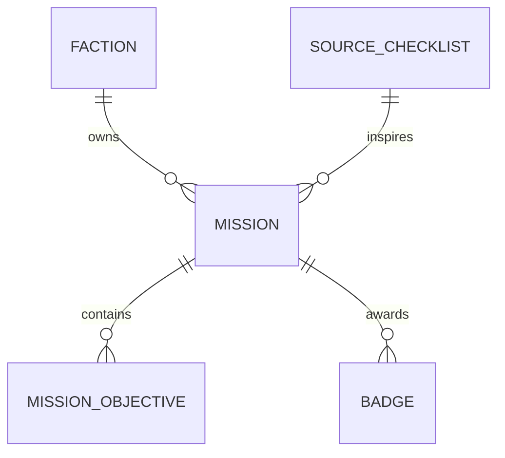

# Provisional Hades Watch Mission Conversion Pack for Activist Checklists

## Executive summary

I could not certify a complete one-to-one extraction of `https://activistchecklist.org/checklists/` from the available research environment, because the exact target URL returned an unknown status when fetched through the browsing tool. I am **not** asserting that the site is publicly offline in ordinary browsers; I am only stating that I could not retrieve it in this research environment. citeturn1view0

To keep the work useful and implementation-ready, I converted a set of closely related, accessible activism checklist and guide sources into a **provisional Hades Watch mission system**. The strongest recurring action families across those sources are: sustained everyday activism; civic participation and representative contact; campaign strategy; writing, media, visual, and data activism; community service and mutual aid; protest archiving and memory work; and nonviolent field preparation with explicit attention to de-escalation, legal context, and participant safety. citeturn30view1turn29image0turn45view0turn46view0turn47view0turn48view0turn44view0turn43view0

The resulting design proposes a six-faction Hades Watch taxonomy, nine mission families, a badge architecture with implementation metadata, and three sample `mission.md` outlines that can be dropped into a content pipeline once a browser-capable export of the activistchecklist site becomes available. The architecture is intentionally built so exact checklist titles and items from activistchecklist can later replace the provisional source rows without changing the Hades Watch mission model. citeturn45view0turn46view0turn43view0

## Source status and research method

The key research constraint is simple: the target activistchecklist URL could not be fetched directly here, so the report below should be read as a **provisional conversion layer**, not as a certified page-for-page transcription of the target site. citeturn1view0

The accessible evidence base is still rich enough to support a serious design. Passion Planner’s “Organizing Activism” worksheet provides a planning-and-reflection model and, in the voter-information panel surfaced through image search, explicitly points users toward checking registration, updating registration, and ballot tracking. The Activist Handbook contributes the most useful campaign structure: vision, stakeholders, goals, objectives, tactics, and evaluation, along with topic families such as social, climate, political, human-rights, youth, and community activism. Invisible Histories’ protest-archiving guide contributes the clearest before/during/after checklist and the strongest privacy guidance around consent, anonymous contribution, and not recording faces or names unless the community wants that. Concern Worldwide’s “Everyday activism” page contributes the low-barrier activism model: connect with others, support organizations, and speak out respectfully. Career Contessa’s “Using Your Strengths to Discover Your Activism” contributes the cleanest skill-lane taxonomy: writing, visual activism, legislation/political action, media activism, data activism, and community service. The activist.org documentation adds the privacy-focused, community-governed platform model. Finally, The Direct Action Movement contributes safe field-prep elements I retained here: planning with affinity groups, assigning roles, bringing basic support items such as food, water, first aid, and chargers, and learning de-escalation and support roles like police liaison or legal observer. citeturn30view1turn29image0turn45view0turn46view0turn47view0turn48view0turn43view0turn44view0

I normalized those sources with a four-step method. First, I reduced each guide into **atomic observable tasks**. Second, I grouped those tasks into **repeatable mission loops** rather than one-off chores. Third, I assigned each loop to the **best-fit Hades Watch faction** based on cognitive style, field risk, care burden, tooling burden, and archival value. Fourth, I designed **badge criteria that require minimal sensitive proof**, because both activist.org and Invisible Histories emphasize privacy and safe participation rather than surveillance-heavy verification. citeturn43view0turn46view0

The assumption layer is explicit. No canonical Hades Watch faction list was supplied in the prompt, so the faction taxonomy below is a recommended open-ended mapping. Difficulty levels are estimated from task complexity, public exposure, and follow-up burden. Rewards are proposed as faction reputation, badge unlocks, and template/tool unlocks rather than material goods.

## Recommended faction taxonomy

The accessible sources naturally cluster into six Hades Watch operational domains. Writing, media, data, and strategy tasks fit one cluster; archiving fits another; low-barrier community action fits another; and care, safety, and de-escalation form their own obvious lane. That structure is consistent with the strategy-oriented, privacy-aware, community-first material surfaced across the source base. citeturn45view0turn48view0turn46view0turn47view0turn43view0turn44view0

| Faction | Recommended remit | Why it fits the source patterns |
|---|---|---|
| **Oracular Circuit** | Strategy, analysis, writing, media, message discipline, data interpretation | Best fit for the Activist Handbook’s strategy stack and for Career Contessa’s writing, media, and data lanes. citeturn45view0turn48view0 |
| **Daedalus Foundry** | Tooling, templates, visual asset production, digital kit-building | Best fit for visual activism, reusable campaign assets, and instrument-building around petitions, briefs, and toolkits. citeturn48view0turn45view0 |
| **Styx Rats** | Neighborhood-level action, connective tissue, local leads, community routing | Best fit for everyday activism, local connection-building, and grounded, low-barrier participation. citeturn47view0turn30view1 |
| **Myrmidon Grinders** | Structured turnout, civic pressure, attendance discipline, public meeting presence | Best fit for voter readiness, city-council participation, calling representatives, and petition escalation. citeturn29image0turn48view0 |
| **Asclepian Veil** | Care work, de-escalation, volunteer support, burnout prevention, protective roles | Best fit for support, grounding, de-escalation, safe participation, and recurring service. citeturn44view0turn45view0turn47view0 |
| **Dead Index** | Archiving, historical preservation, metadata, movement memory | Best fit for the Invisible Histories archiving checklist and “memory worker” framing. citeturn46view0 |

A clean visual language follows from this taxonomy. Oracular Circuit badges should read as cobalt-violet signal logic. Daedalus Foundry should feel brass, rust, cyan, and blueprint-like. Styx Rats should feel sewer-teal, toxic green, and improvised but warm. Myrmidon Grinders should use warning amber, white, and gunmetal. Asclepian Veil should use seafoam, pale jade, and sterile white. Dead Index should use obsidian, ultraviolet, and parchment-bone.

## Checklist-to-mission conversion matrix

Because the activistchecklist crawl did not complete, the table below should be understood as a **conversion matrix from verified adjacent checklist/guidance sources into Hades Watch mission objects**. The structure is intentionally stable: if you later obtain a manual export of activistchecklist, you can swap the source title and source items into the same rows while preserving slugs, factions, and badge families.

| Source checklist or guide | Normalized objective cluster | Proposed mission and slug | Best-fit faction | Lead badge set | Estimated time and difficulty | Privacy and safety notes | External resource anchor |
|---|---|---|---|---|---|---|---|
| **Organizing Activism worksheet**; reflective prompts on causes, favorite activists, and planning advocacy. citeturn30view1 **Everyday activism**; connect with others, support organizations, speak out respectfully. citeturn47view0 | Define what matters, choose small durable actions, build one local connection, act without waiting for virality | **Signal Hearth** `signal-hearth` | **Styx Rats** | Hearth Ember; Neighborhood Lantern | 30–60 minutes; Easy | Default missions should keep journaling private and require only redacted public proof if users share outputs. Respectful engagement matters more than performative posting. citeturn47view0turn43view0 | Passion Planner worksheet; Concern “Everyday activism” |
| **Organizing Activism worksheet** voter-info panel: check registration, update registration, ballot tracking. citeturn29image0 **Legislation and Political Activism**: attend city-council meetings, comment on legislation, call representatives, create petitions. citeturn48view0 | Convert concern into civic contact, meeting attendance, office pressure, and documented follow-up | **Council Pulse** `council-pulse` | **Myrmidon Grinders** | Switchboard Ember; Quorum Ghost | 60–120 minutes; Medium | Public proof should be a redacted contact log or meeting summary, not private constituent data. Local legal and procedural context varies. citeturn48view0turn43view0 | Passion Planner voter-info panel; Career Contessa civic lane |
| **Activist Handbook** strategy chapter: organize yourselves, write vision, stakeholders, goals, objectives, tactics, evaluation. citeturn45view0 | Turn issue energy into a coherent campaign spine with measurable objectives and feedback loops | **Campaign Spine** `campaign-spine` | **Oracular Circuit** | Objective Smith; Theory Spline | 2–4 hours; Medium | The mission should collect planning outputs, not sensitive participant directories. Threat-model before sharing strategy docs. citeturn45view0turn43view0 | Activist Handbook campaign strategy suite |
| **Social Justice Writing** and **Media Activism**: blog, pitch, write, amplify underrepresented voices, use media/social platforms strategically. citeturn48view0 | Create one useful, public-facing issue explainer, media brief, or narrative relay | **Quiet Megaphone** `quiet-megaphone` | **Oracular Circuit** | Byline Spark; Relay Editor | 2–6 hours; Medium | Do not publish personal data, exposed faces, or retraumatizing detail without consent; prioritize source integrity and attribution. citeturn48view0turn46view0 | Career Contessa writing/media lanes |
| **Visual Activism**: murals, creative depictions, diverse participation, image-based disruption. citeturn48view0 | Build a poster, banner, stencil pack, mural concept, or digital visual asset set | **Street Canvas** `street-canvas` | **Daedalus Foundry** | Wall Bloom | 3–8 hours; Medium | Require alt text, accessibility notes, and, for public display, local consent/permission checks. citeturn48view0 | Career Contessa visual activism lane |
| **Data Activism**: collect local perceptions, survey experiences, generate actionable findings. citeturn48view0 | Gather a small dataset, summarize it, and turn it into one recommendation | **Pulse Survey** `pulse-survey` | **Oracular Circuit** | Pattern Reader | 3–5 hours; Medium | Use consent, anonymization, and data minimization by default; do not expose raw respondent identities. citeturn48view0turn43view0 | Career Contessa data activism lane |
| **Community Service Activism** and **Everyday activism**: support organizations, donate, volunteer, share expertise, start neighborhood help. citeturn48view0turn47view0 | Perform one grounded service action or coordinate one recurring care loop | **Hands to Ground** `hands-to-ground` | **Asclepian Veil** | Mutual Aid Hand | 1–3 hours; Easy to Medium | Keep aid-recipient information private; verify org legitimacy; separate public gratitude from beneficiary details. citeturn47view0turn43view0 | Concern “Everyday activism”; Career Contessa service lane |
| **How to Archive a Protest**: consent, materials brainstorm, storage/security, label as you go, upload, debrief, archive partner outreach. citeturn46view0 | Preserve movement memory with contextual metadata instead of dumping files into a void | **Mirror Archive** `mirror-archive` | **Dead Index** | Sign Keeper; Underwatch Archivist | 2–6 hours; Medium | This mission should default to consent checks, anonymous contribution options, delayed release for sensitive media, and “do not record faces/names” toggles. citeturn46view0 | Invisible Histories archiving guide |
| **Preparing for Direct Action**: plan with your group, assign roles, bring food/water/first aid/chargers, understand legal context, use police liaison/legal observer roles, practice de-escalation. citeturn44view0 | Focus on safe nonviolent field prep and support roles rather than operational escalation | **Affinity Thread** `affinity-thread` | **Asclepian Veil** | Calm Link; Observer Veil | 2–4 hours; Medium | Keep this mission strictly nonviolent, de-escalatory, and locally lawful; never require unlawful tactics as criteria. Legal context differs by place and participant risk. citeturn44view0 | Direct Action Movement field-prep page |

The main architectural conclusion is that Hades Watch should **not** treat activist checklists as flat tasks. The Activist Handbook’s campaign structure shows why: effective organizing depends on connecting objectives, tactics, evaluation, and local context, rather than rewarding isolated action fragments. Concern’s “everyday activism” page and Invisible Histories’ archiving guide point in the same direction from different angles: small, repeatable actions matter, but they matter most when they connect to community, memory, and follow-up. citeturn45view0turn47view0turn46view0

## Badge system and visual direction

Badge criteria should be **evidence-light and privacy-first**. The safest default is to accept redacted notes, public links, anonymized summaries, or moderator-reviewed checkboxes rather than raw personal data, participant lists, or unredacted screenshots. That recommendation follows directly from activist.org’s privacy-focused platform framing and Invisible Histories’ warnings about consent, anonymous contribution, and not recording faces or names by default. citeturn43view0turn46view0

| Mission | Badge ID | Badge name | Icon idea | Color palette | Rarity | Unlock criteria |
|---|---|---|---|---|---|---|
| `signal-hearth` | `badge_hearth_ember` | **Hearth Ember** | Lantern with a tiny pulse line | Warm amber / bone / sewer teal | Common | Complete one cause reflection and commit to three concrete next actions |
| `signal-hearth` | `badge_neighborhood_lantern` | **Neighborhood Lantern** | Map pin inside lantern cage | Seafoam / charcoal / cream | Rare | Log one local group connection and one follow-up action |
| `council-pulse` | `badge_switchboard_ember` | **Switchboard Ember** | Handset inside a signal ring | Acid green / gunmetal / bone | Common | Submit one verified office-contact log and one issue summary |
| `council-pulse` | `badge_quorum_ghost` | **Quorum Ghost** | Minimal city-hall silhouette with echo lines | Cobalt / white / warning amber | Rare | Attend one public meeting and publish one redacted summary or comment |
| `campaign-spine` | `badge_objective_smith` | **Objective Smith** | Anvil crossed with checklist bolt | Brass / graphite / violet | Common | Define vision, stakeholders, and at least three objectives |
| `campaign-spine` | `badge_theory_spline` | **Theory Spline** | Vertebrae-like spine with forward arrow | Neon violet / silver / midnight | Rare | Complete a full objectives–tactics–evaluation sheet for a live campaign |
| `quiet-megaphone` | `badge_byline_spark` | **Byline Spark** | Pen nib emitting signal arcs | Electric blue / bone / dark slate | Common | Publish one issue explainer, letter, or op-ed style artifact |
| `quiet-megaphone` | `badge_relay_editor` | **Relay Editor** | Typewriter key over waveform | Indigo / white / pale cyan | Rare | Produce a multi-part media relay or press-ready brief |
| `street-canvas` | `badge_wall_bloom` | **Wall Bloom** | Stencil flower over a brick line | Rust / cyan / cream | Common | Submit one poster, mural concept, banner, or stencil pack with alt text |
| `pulse-survey` | `badge_pattern_reader` | **Pattern Reader** | Eye above a histogram | Violet / mint / black | Rare | Publish anonymized findings plus one concrete recommendation |
| `hands-to-ground` | `badge_mutual_aid_hand` | **Mutual Aid Hand** | Open hand carrying a parcel | Soft green / bone / navy | Common | Complete one documented service or support action |
| `mirror-archive` | `badge_sign_keeper` | **Sign Keeper** | Protest sign inside an archival sleeve | Obsidian / parchment / ultraviolet | Common | Collect and label three artifacts with basic context fields |
| `mirror-archive` | `badge_underwatch_archivist` | **Underwatch Archivist** | Folder with an eye sigil and metadata tabs | Black / ultraviolet / silver | Epic | Complete collection, labeling, upload, consent notes, and debrief summary |
| `affinity-thread` | `badge_calm_link` | **Calm Link** | Interlocked hands with a water droplet | Teal / charcoal / white | Common | Assign support roles and complete a de-escalation/team prep briefing |
| `affinity-thread` | `badge_observer_veil` | **Observer Veil** | Notebook behind a shield motif | Jade / white / smoke grey | Rare | Safely document a public action and file a redacted after-action support note |

Here are three quick **rendered text examples** for visual tone:

```text
[ COMMON ] SWITCHBOARD EMBER
☎≈
acid green / gunmetal / bone
Unlock: one verified office contact + one redacted issue log
```

```text
[ RARE ] THEORY SPLINE
⇉
neon violet / silver / midnight
Unlock: objectives + tactics + evaluation for one live campaign
```

```text
[ EPIC ] UNDERWATCH ARCHIVIST
▣◉
obsidian / ultraviolet / parchment
Unlock: collect, label, upload, consent-check, and debrief an action archive
```

Visually, the best source references for mission-card direction are the Activist Handbook homepage card, the archiving “Summary Checklist,” and the Direct Action Movement toolkit poster: they are all clean, task-forward, legible at a glance, and built around bold symbolic objects rather than decorative ambiguity. citeturn29image6turn29image4turn29image10

## Sample mission outlines

The three sample mission files below are the best representatives of the whole conversion set because they cover the three most important Hades Watch loops: **civic pressure**, **movement memory**, and **campaign architecture**. Their source models are directly visible in the accessible research base. Council Pulse is derived from the voter-information prompts surfaced through the Organizing Activism worksheet and from Career Contessa’s legislation/political-activism lane. citeturn29image0turn48view0

```md
---
title: Council Pulse
mission_slug: council-pulse
faction: Myrmidon Grinders
checklist_title:
  - Organizing Activism Worksheet — Voter Information
  - Using Your Strengths to Discover Your Activism — Legislation and Political Activism
checklist_items:
  - Check or update voter registration and ballot tracking status
  - Attend a local public meeting or review the public agenda
  - Contact a representative or public office
  - Submit a comment, issue summary, or follow-up note
badge_metadata:
  - id: badge_switchboard_ember
    name: Switchboard Ember
    icon_idea: handset inside a signal ring
    color_palette: acid green / gunmetal / bone
    rarity: Common
    unlock_criteria: Submit one verified office-contact log and one issue summary
  - id: badge_quorum_ghost
    name: Quorum Ghost
    icon_idea: city-hall silhouette with echo lines
    color_palette: cobalt / white / warning amber
    rarity: Rare
    unlock_criteria: Attend one public meeting and publish one redacted summary or comment
estimated_time: "60–120 minutes"
estimated_difficulty: "Medium"
privacy_safety_notes:
  - Redact personal addresses, phone numbers, and constituent identifiers from public proof
  - Keep raw notes private by default
  - Verify local meeting rules, registration procedures, and civic deadlines before submission
external_resources:
  - Organizing Activism worksheet
  - Career Contessa civic-engagement article
rewards:
  faction_rep: 30
  unlocks:
    - call-script-template
    - public-comment-template
    - local-office-log
---

# Goal
Turn concern into documented civic pressure.

# Steps
1. Pick one local or state issue that matters to you.
2. Check the relevant civic status associated with that issue if applicable.
3. Identify one office, representative, committee, or public meeting connected to the issue.
4. Make one contact or attend one meeting.
5. Write a concise redacted summary of what happened and what the next action should be.

# Acceptance Criteria
- One issue focus selected
- One verified civic action completed
- One follow-up note or summary logged
- No sensitive personal information included in public proof

# Rewards
- Badge unlock: Switchboard Ember
- +30 Myrmidon Grinders reputation
- Unlocks reusable call and meeting-note templates

# Suggested Assets
- Representative finder
- Meeting-note form
- Call script template
- Personal redaction helper
```

Mirror Archive is grounded in Invisible Histories’ before/during/after protest archiving guide and its summary checklist, especially the emphasis on consent, security, labeling, upload, and debrief. citeturn46view0

```md
---
title: Mirror Archive
mission_slug: mirror-archive
faction: Dead Index
checklist_title:
  - How to Archive a Protest: A Field Guide For Southern Memory Workers
checklist_items:
  - Discuss consent, community agreements, and safety
  - Brainstorm what materials should be preserved
  - Label materials as they are gathered
  - Sort, upload, and debrief after the event
badge_metadata:
  - id: badge_sign_keeper
    name: Sign Keeper
    icon_idea: protest sign inside archival sleeve
    color_palette: obsidian / parchment / ultraviolet
    rarity: Common
    unlock_criteria: Collect and label three artifacts with context
  - id: badge_underwatch_archivist
    name: Underwatch Archivist
    icon_idea: metadata folder with eye sigil
    color_palette: black / ultraviolet / silver
    rarity: Epic
    unlock_criteria: Complete collection, labeling, upload, consent notes, and debrief summary
estimated_time: "2–6 hours"
estimated_difficulty: "Medium"
privacy_safety_notes:
  - Do not record or publish faces, names, or personal identifiers without consent
  - Allow anonymous contribution wherever possible
  - Delay public release if the archive contains sensitive material
external_resources:
  - Invisible Histories field guide
  - Commons Library protest archiving resource page
rewards:
  faction_rep: 35
  unlocks:
    - metadata-sheet
    - archive-drop-form
    - consent-toggle-module
---

# Goal
Preserve movement memory without sacrificing participant safety.

# Steps
1. Before the event, define what types of materials matter.
2. Decide who is collecting and how materials will be transported and stored.
3. During the event, gather items and immediately add minimal context.
4. After the event, sort, upload, and document what the archive contains.
5. Hold a short debrief to capture the story behind the materials.

# Acceptance Criteria
- At least three artifacts or files preserved
- Each item labeled with date, source context, and event link
- One consent or anonymity note recorded
- One archive debrief completed

# Rewards
- Badge unlock: Sign Keeper
- +35 Dead Index reputation
- Unlocks metadata and archival intake tools

# Suggested Assets
- Artifact intake card
- Consent selector
- Shared-drive uploader
- Event debrief template
```

Campaign Spine is rooted in the Activist Handbook’s campaign structure: organize yourselves, then work through vision, stakeholders, goals, objectives, tactics, and evaluation. citeturn45view0

```md
---
title: Campaign Spine
mission_slug: campaign-spine
faction: Oracular Circuit
checklist_title:
  - Activist Handbook — Campaign Strategy
checklist_items:
  - Define vision
  - Map stakeholders
  - Set goals and objectives
  - Choose tactics
  - Plan evaluation
badge_metadata:
  - id: badge_objective_smith
    name: Objective Smith
    icon_idea: anvil crossed with checklist bolt
    color_palette: brass / graphite / violet
    rarity: Common
    unlock_criteria: Define vision, stakeholders, and three objectives
  - id: badge_theory_spline
    name: Theory Spline
    icon_idea: vertebrae spine with forward arrow
    color_palette: neon violet / silver / midnight
    rarity: Rare
    unlock_criteria: Complete an objectives–tactics–evaluation sheet for a live campaign
estimated_time: "2–4 hours"
estimated_difficulty: "Medium"
privacy_safety_notes:
  - Strategic documents should default to private or team-only visibility
  - Share public summaries, not sensitive coordination notes
  - Revisit risk and local context before moving from strategy to action
external_resources:
  - Activist Handbook campaign strategy suite
rewards:
  faction_rep: 40
  unlocks:
    - objective-mapper
    - stakeholder-board
    - tactic-evaluation-sheet
---

# Goal
Turn a cause into a coherent campaign plan.

# Steps
1. Write a one-paragraph vision.
2. Identify allies, opponents, institutions, and affected communities.
3. Convert the vision into one goal and three measurable objectives.
4. Match one tactic to each objective.
5. Decide how progress will be evaluated after action.

# Acceptance Criteria
- Vision, stakeholder map, goal, objectives, tactics, and evaluation fields are complete
- Objectives are measurable
- At least one risk or local-context note is logged
- Public sharing version is redacted if the mission is active

# Rewards
- Badge unlock: Objective Smith
- +40 Oracular Circuit reputation
- Unlocks planning and evaluation templates

# Suggested Assets
- Stakeholder map widget
- Objective editor
- Tactics library
- Evaluation note template
```

## Delivery phases and data model

The right delivery sequence is: first, obtain a browser-capable export of the activistchecklist pages; second, normalize exact checklist items into atomic objectives; third, map those objectives onto the mission slugs defined here; fourth, produce badge art and mission card assets; fifth, run a privacy/legal review before publication. That sequence reflects both the strategy discipline from the Activist Handbook and the safety/privacy concerns foregrounded by activist.org and Invisible Histories. citeturn1view0turn45view0turn43view0turn46view0



The mission relationship model should stay deliberately simple: one faction owns many missions; one mission can be adapted from one or more source checklists; and one mission can award multiple badges.



A practical import schema for Hades Watch should look like this:

```yaml
checklist_title: string
checklist_items:
  - string
mission_name: string
mission_slug: string
faction: string
badge_metadata:
  - id: string
    name: string
    icon_idea: string
    color_palette: string
    rarity: Common | Uncommon | Rare | Epic
    unlock_criteria: string
estimated_time: string
estimated_difficulty: Easy | Medium | Hard
goal: string
steps:
  - string
acceptance_criteria:
  - string
rewards:
  faction_rep: integer
  unlocks:
    - string
privacy_safety_notes:
  - string
external_resources:
  - string
suggested_assets:
  - string
source_confidence: direct | adjacent | inferred
```

The critical implementation insight is that **source confidence should be stored as data**. For this report, the mission and badge layer is strong enough to implement now, but the activistchecklist-specific checklist inventory should be marked `source_confidence: inferred` or `adjacent` until a direct page export is available. The architecture above lets you do that cleanly without throwing away the design work.